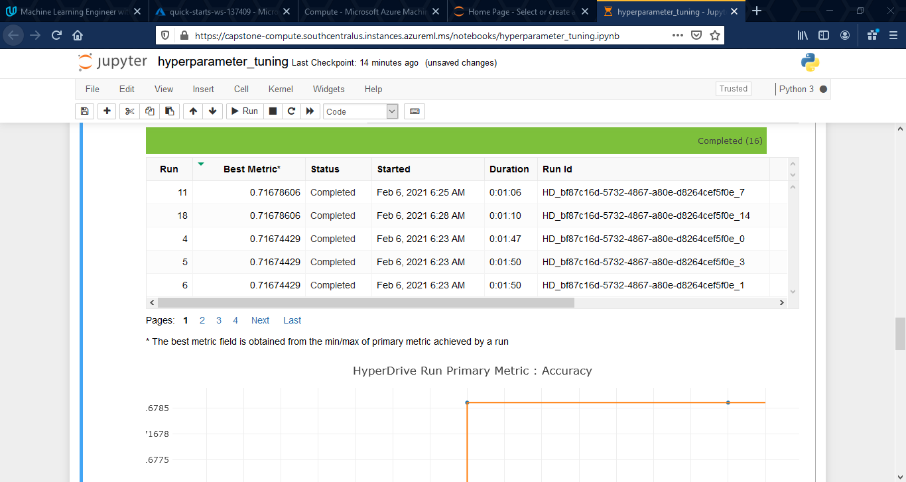
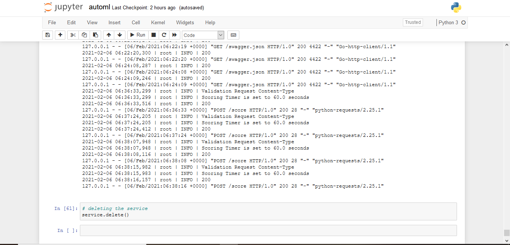
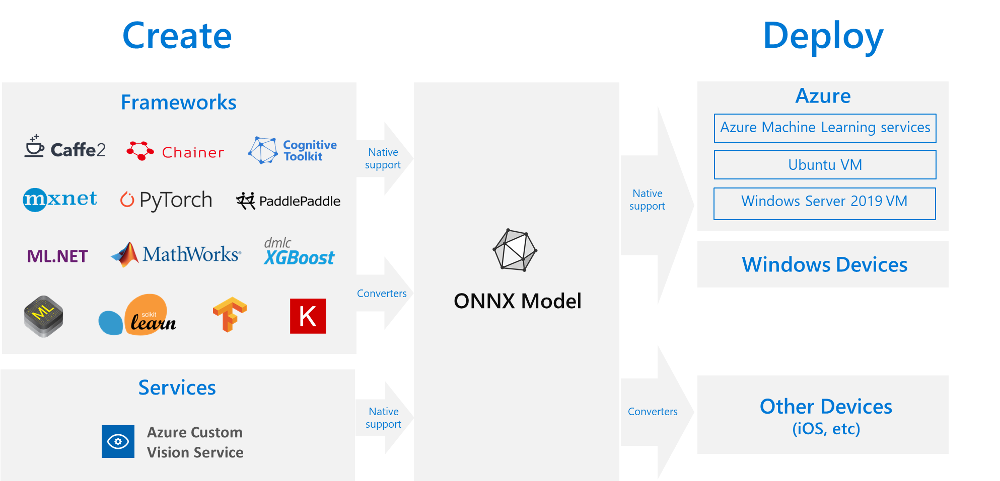

# Capstone Project - Loan Default Prediction

This is the last of three projects required for the fulfilment of the Microsoft Azure Machine Learning Engineer Nanodegree Program with Udacity.

This is a follow up to an [earlier project](https://github.com/ChidiNdego/Loan-Defaulters-Prediction) on the same loan default dataset. The earlier project was completed with the traditional data science method using jupyter notebook. It was accomplished using Random Forest and Neural Network models. 
Here, a faster and profitable cloud-based solution is provided using Microsoft Azure Machine Learning Ecosystem.  

This project entails creating two machine learning models: one using AutoML and the other is a customized model whose hyperparameters are tuned using hyperdrive. The performance of both models would be compared and only the best performing model would be deployed as a web service. The model endpoint is also tested to validate its performance by sending an HTTP POST request.

#### Project Workflow


## Dataset

### Overview

The data used in this project is an external dataset not hosted on the Azure ecosystem: A nationwide loan default dataset from a private FinTech company based in Lagos, Nigeria. Reported from the data, about `27.99%` of the company's customers that request for loans fulfill the agreed terms in the loan contract, while a substantial `72.01%` defaulted. 

The dataset is made up of `159596` different loan request records/entries represented by rows and 23 features/attributes of each entry.

Suffice to say that the data was cleaned with the `clean` function made available in the [training script](train.py).

### Task

The target column is identified as `loanDefault`, consisting of only two entries: `0` describing a defaulted loan entry and `1` implying no default; hence, a classification problem. 

#### Features and definitions

*   `loanId`: Unique identifier for each loan request.
*   `firstPaymentDefault`: `0` or `1` means default or no-default entries respectively on their first payment as agreed.
*   `firstPaymentRatio`: Fraction of loan repaid on first payment date as agreed. 
*   `max_amount_taken`: `1` represents loan record taken at maximum amount. `0` represents loan record below maximize loan amount available.
*   `max_tenor_taken`: `1` represents entries maximizing the available period/tenor for loans taken. `0` entries are below the maximum available tenor.  
*   `loanTerm`: Duration of the loan: `60`, `90`, or `180` days. 
*   `loanAmount`: Amount of loan in naira.
*   `interestRate`: Amount of interest to be paid on loan. 
*   `dueDate`: Due date for loan to be repaid. 
*   `clientId`: Unique identifier for each loan customer.
*   `clientIncome`: Monthly income of customer in naira. 
*   `incomeVerified`: `True` or `False` if customer monthly income has been verified.
*   `clientAge`: Age of customer in years. 
*   `clientGender`: Gender of customer: `MALE` or `FEMALE`. 
*   `clientMaritalStatus`: Marital status of customer: `Married`, `Single`, `Separated`, `Widowed`, or `Divorced`.
*   `clientLoanPurpose`: Purpose of loan: `education`, `house`, `business`, `other`, or `medical`.
*   `clientResidentialStauts`: Status of customer's residency: `Own Residence`, `Rented`, `Family Owned`, `Employer Provided`, or `Temp Residence`. 
*   `clientState`: Location of customer's residency in Nigeria. 
*   `clientTimeAtEmployer`: Number of years with present employers.
*   `clientNumberPhoneCOntacts`: Number of contact on customer's phone.
*   `clientAvgCallsPerDay`: Average number of calls made/received per day. 
*   `loanNumber`: Customer's loan record count with company.
*   `loanDefault`: Target variable. `0` or `1` means default or no-default respectively.
       
### Access

The dataset, in `.csv` format, is hosted on this gitub repository and can be accessed from this link:

https://raw.githubusercontent.com/ChidiNdego/loan-default-capstone-project/master/starter_file/loan_default_prediction.csv

A tabular dataset must be represented correctly before use in Azure ML Studio.

TabularDataset is created using methods like `azureml.data.dataset_factory.TabularDatasetFactory.from_delimited_files` from the `TabularDatasetFactory` class as shown below:

```
url = "https://raw.githubusercontent.com/ChidiNdego/loan-default-capstone-project/master/starter_file/loan_default_prediction.csv"

data = TabularDatasetFactory.from_delimited_files(url)
```

## Automated ML

Overview of the `automl` settings and configuration used for this experiment:

*   `"experiment_timeout_minutes": 30`: Maximum amount of time (in minutes) to complete training itertions. Set at 30 minutes because dataset has over 100,000 entries.
*   `"max_concurrent_iterations": 5`: Maximum number of iterations that can be executed simultaneously. Advisably, this value should be less than the number of compute cluster node.
*   `"n_cross_validations": 5`: Cross validation is a model validation technique used to reduce overfitting. `n` is the number of training examples.
*   `"primary_metric" : 'Accuracy'`: This parameter determines the metric to be used during model training for optimization.
*   `compute_target=cpu_cluster`: This points to the compute cluster configuration created azure workspace at the start of the project.
*   `task = "classification"`: The project task is a classification problem.
*   `training_data=automl_data`: Specifies the dataset to be used: an external dataset already registered in azure datastore.
*   `label_column_name="loanDefault"`: Specifies the dependent variable to be predicted.
*   `enable_early_stopping=True`: Allows for application of an early stopping rule during training.
*   `featurization= 'auto'`: Allows azure to automatically perform feature engineering on dataset.
*   `enable_onnx_compatible_models=True`: Allows for model to be converted to onnx format.

### Results

The completed automl experiment is shown below. The best model is the `VotingEnsemble` model with an accuracy of `85.22%` as seen on top of the list: 


*figure 1: completed automl experiment*

Various metrics of the best model is seen below:


*figure 2: best model metrics*

#### Parameters of the best model

[Voting Ensemble](https://machinelearningmastery.com/voting-ensembles-with-python/), is an ensemble machine learning model that combines the predictions from multiple other models. Here, it represents a collection of autoML iterations brought together to form an ensemble that implements soft voting.

The VotingEnsemble model from our experiment consist of eight algorithms. Below shows each algorithm and some parameters: `weight` , `learning_rate`, `gamma`, `n_estimators`, `reg_lambda`, `C`, `class_weight`, `l1_ratio`, `max_iter`, and `verbose`. 

Refer to the [automl notebook](automl.ipynb) for more detailed information.

| | ALGORITHM | WEIGHT | LEARNING RATE | GAMMA | NUMBER OF ESTIMATORS | LAMBDA |
|--| --------- | --------- | --------- | --------- | --------- | --------- |
| 1 | xgboostclassifier + maxabsscaler | 0.2 | 0.1 | 0 | 100 | 1 |
| 2 | lightgbmclassifier + maxabsscaler (0) | 0.1 | 0.1 | - | 100 | 0 |
| 3 | lightgbmclassifier + maxabsscaler (19) | 0.1 | 0.042 | - | 100 | 0.1052 |
| 4 | xgboostclassifier + sparsenormalizer (6) | 0.1 | 0.1 | 0 | 100 | 2.0833 |
| 5 | xgboostclassifier + sparsenormalizer (9) | 0.2 | 0.1 | 0 | 100 | 1.875 |
| 6 | xgboostclassifier + standardscalerwrapper | 0.1 | 0.1 | 0 | 10 | 2.0833 |
| 7 | xgboostclassifier + sparsenormalizer (28) | 0.1 | 0.1 | 0 | 25 | 2.5 |

| | ALGORITHM | INVERSE REG | CLASS WEIGHT | L1 RATIO | MAX ITER | VERBOSE |
|--| --------- | --------- | --------- | --------- | --------- | --------- |
| 8 | logisticregression + maxabsscaler | 2.5595 | None | None | 100 | 0 |

#### Suggestions for possible improvement

*   Increase experiment timeout duration. This would allow for more model experimentation, but at expense of cost.
*   Try a different primary metric. Sometimes accuracy alone doesn't represent true picture of the model's performance. Recall or precision are more specific metrics in related classification problems.
*   Tweak some other AutoML confirguration parameters including number of cross validation to reduce model bias.
*   Clean data function: Values were imputed to treat missing entries. Possibly, doing away with such rows may produce a better model. 


## Hyperparameter Tuning

The problem at hand is a classification task; hence, a Logistic regression model was used. SKLearn's logistic regression algorithm is a well-known supervised learning approach optimized for dichotomous or binary variables.

#### Overview of the hyperparameters used

Hyperparameters are adjustable parameters that let you control the model training process. Hyperparameter tuning is the process of finding the configuration of hyperparameters that results in the best performance. The process is typically computationally expensive and manual.

The two hyperparamters used in this experiment are `C` and `max_iter`. `C` is the Inverse Regularization Strength which applies a penalty to stop increasing the magnitude of parameter values in order to reduce overfitting. `max_iter` is the maximum iteration to converge for the SKLearn Logistic Regression algorithm.

The hyperparameter search range used for `C` is [1, 2, 3, 4, 5, 6] and for `max_iter` is [50, 100, 150, 200, 250, 300].

### Results

The completed hyperdrive experiment is shown below: 


*figure 3: running hyperdrive experiment*


*figure 4: completed hyperdrive experiment*

Evidently, the best run outputs an accuracy of `71.68%` with optimized hyperparameters: `C = 2` and `max_iter = 150` as shown below:


*figure 5: parameters of the best hyperdrive model*

#### Suggestions for possible improvement

*   Clean data function: Values were imputed to treat missing entries. Possibly, doing away with such rows may produce a better model. 
*   Parameter sampling can be carried out more effectively. Increase in RandomParameterSampling or start with a wide range of values for each parameter, then refine the search space.
*   Apply other types of parameter sampling including the Bayesian Parameter Sampling. Bayesian sampling tries to intelligently pick the next sample of hyperparameters, based on how the previous samples performed, such that the new sample improves the reported primary metric.
*   Try a different primary metric. Sometimes accuracy alone doesn't represent true picture of the model's performance. Recall or precision are more specific metrics in related classification problems where False negative is preferred over False positive.
*   Tweak some other hyperdrive confirguration parameters including max total runs, to try a lot more combinations.


## Model Deployment

The results from the two models are compared:


*figure 6: Model comparison*

Obviously, the automl model is the better model based off accuracy; hence, the chosen model for deployment. The deployment is seen to be successful and healthy below:


*figure 7: Successful deployment*


*figure 8: healthy state of deployed model*

Next, we query the endpoint with a sample input.

The sample data:


*figure 9: sample data to query endpoint*

[Endpoint script](endpoint.py) is updated with the sample data above as well as deployed model's `scoring_uri` and `key`.


*figure 10: Deployed web service details*

Execution of the endpoint script returns the response from our deployed model. Clearly, it returns the expected output for the sample data.


*figure 11: response from deployed web service*

The log readings from the service endpoint is shown below:


*figure 12: service endpoint log*

At the end, we delete the webservice and shutdown all the computes that have been used.


*figure 13: delete the webservice*


## Screen Recording

Here is a [screencast](https://youtu.be/VS_oyPOgB64) of this project showing key steps in the process.

## Standout Suggestions

### ONNX Model Conversion


*figure 14: How ONNX works*

ONNX, Open Neural Network Exchange is an open-source portability platform for models that allow you to convert models from one framework to another, say, TensorFlow or Caffe, or even to deploy models to a device such as an iOS or Android mobile device.
It can also help to optimize the inference of your machine learning model. Inference, or model scoring, is the phase where the deployed model is used for prediction, most commonly on production data.


*figure 14: ONNX model conversion 01*


*figure 15: ONNX model conversion 02*

### Enable Logging
Logging is a core pillar of MLOps. It gives information on how deployed models are behaving over time. Enabling application insight helps to fulfil this purpose. Detection of anomalies, performance visualization, and log retrieval can be done using the Python SDK.

Update the Log script with the deployed model name and pass in `service.update(enable_app_insights=True)` before executing the log script as seen below:


*figure 16: running log script to enable logging*

Confirm application is enabled from azure ml studio:


*figure 17: application insight enabled*

Click the application insight url to see charts proving that logging has been enabled:


*figure 18: application insight visuals*


## References

*   [TabularDataset Class](https://docs.microsoft.com/en-us/python/api/azureml-core/azureml.data.tabulardataset?view=azure-ml-py#to-pandas-dataframe-on-error--null---out-of-range-datetime--null--)
*   [Hyperparameter tuning a model with Azure Machine Learning](https://docs.microsoft.com/en-us/azure/machine-learning/how-to-tune-hyperparameters)
*   [AutoML with Microsoft Azure](https://docs.microsoft.com/en-us/azure/machine-learning/concept-automated-ml)
*   [Voting Ensembles with Python](https://machinelearningmastery.com/voting-ensembles-with-python/)
*   [Ensemble Learning in Machine Learning](https://towardsdatascience.com/ensemble-learning-in-machine-learning-getting-started-4ed85eb38e00)
*   [ONNX Model Conversion](https://docs.microsoft.com/en-us/azure/machine-learning/concept-onnx)